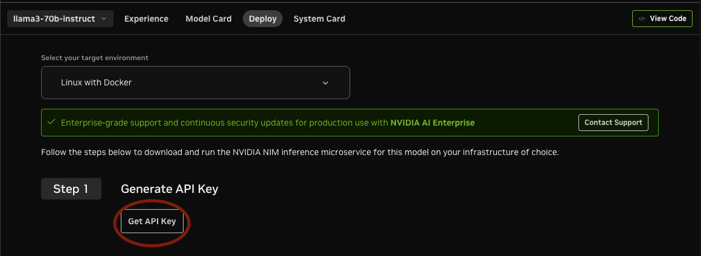
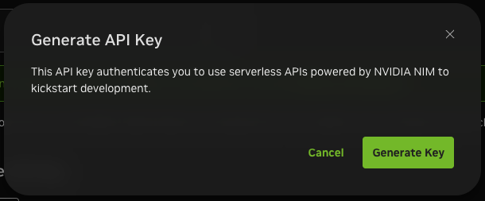

<!--
SPDX-FileCopyrightText: Copyright (c) 2025 NVIDIA CORPORATION & AFFILIATES. All rights reserved.
SPDX-License-Identifier: Apache-2.0
 *
Licensed under the Apache License, Version 2.0 (the "License");
you may not use this file except in compliance with the License.
You may obtain a copy of the License at
 *
http://www.apache.org/licenses/LICENSE-2.0
 *
Unless required by applicable law or agreed to in writing, software
distributed under the License is distributed on an "AS IS" BASIS,
WITHOUT WARRANTIES OR CONDITIONS OF ANY KIND, either express or implied.
See the License for the specific language governing permissions and
limitations under the License.
-->

# Setup and Usage

## Prerequisites

Docker is required to start the desired Database for the following guide. Install docker and enable CUDA support.

### Setting up docker with CUDA support
1. Install Docker for the required operating system. [Docker Installation](https://docs.docker.com/engine/install/ubuntu/)
1. Install Nvidia Container Toolkit to enable CUDA support for Docker. [Nvidia Container Toolkit](https://docs.nvidia.com/datacenter/cloud-native/container-toolkit/latest/install-guide.html)

For advanced setup, refer [CA RAG Advanced Setup](../intro/advanced-setup.md)

## Environment Setup

### Getting NVIDIA API Key
NVIDIA_API_KEY is NVIDIA Personal Key to use LLM and Rerank and Embeddings NIMs from build.nvidia.com. This key is essential for accessing NVIDIA’s cloud services and models. Here are the steps to get the NVIDIA API Key:
1. Log in to [https://build.nvidia.com/explore/discover](https://build.nvidia.com/explore/discover).

2. Navigate to any NIM e.g. [https://build.nvidia.com/meta/llama-3_1-70b-instruct](https://build.nvidia.com/meta/llama-3_1-70b-instruct). Switch to the "Deploy" tab.

3. Search for "Get API Key" button on the page and click on it.



4. Click on Generate Key.



5. Copy and store the generated API Key securely for future use.

Now set up the environment variables depending on the type of RAG.

### Vector-RAG: Milvus

```bash
export MILVUS_DB_HOST=${MILVUS_HOST_IP} #milvus host, e.g. localhost
export MILVUS_DB_PORT=${MILVUS_DB_PORT} #milvus port, e.g. 19530
export NVIDIA_API_KEY=${NVIDIA_API_KEY} #NVIDIA API key
```

### Graph-RAG: Neo4j

```bash
export GRAPH_DB_HOST=${GRAPH_DB_HOST} #neo4j
export GRAPH_DB_PORT=${GRAPH_DB_PORT} #neo4j port, e.g. 7687
export GRAPH_DB_USERNAME=${GRAPH_DB_USERNAME} #neo4j username, e.g. neo4j
export GRAPH_DB_PASSWORD=${GRAPH_DB_PASSWORD} #neo4j password, e.g. password
export NVIDIA_API_KEY=${NVIDIA_API_KEY} #NVIDIA API key
```

## Running dependent containers and setting up environment variables

### Vector-RAG: Milvus

```bash
curl -sfL https://raw.githubusercontent.com/milvus-io/milvus/master/scripts/standalone_embed.sh -o standalone_embed.sh


bash standalone_embed.sh start
```

This will start the milvus service by default on port 19530.

If using Graph-RAG, you will need to run the following container.

### Graph-RAG: Neo4j

```bash
export GRAPH_DB_HTTP_PORT=${GRAPH_DB_HTTP_PORT} #(optional) neo4j HTTP port, e.g. 7474

docker run -d \
  --name neo4j \
  -p ${GRAPH_DB_HTTP_PORT:-7474}:7474 \
  -p ${GRAPH_DB_PORT:-7687}:7687 \
  -e NEO4J_AUTH=${GRAPH_DB_USERNAME:-neo4j}/${GRAPH_DB_PASSWORD:-passneo4j} \
  -e NEO4J_PLUGINS='["apoc"]' \
  neo4j:5.26.4
```

## Using the Python Library

The Context Aware RAG library can be used to both add and retrieve documents using python.

### Setting up config file

First create a config file to set the LLMs, prompts, and parameters. A sample config file is provided at
[config/config.yaml](https://github.com/NVIDIA/context-aware-rag/tree/main/config/config.yaml). Refer to the [CA RAG Configuration](../overview/configuration.md) guide for more details.

Here is an example of the config file for using `GraphRAG` using Neo4j DB:

```yaml
tools:
  graph_db:
    type: neo4j
    params:
      host: !ENV ${GRAPH_DB_HOST}
      port: !ENV ${GRAPH_DB_PORT}
      username: !ENV ${GRAPH_DB_USERNAME}
      password: !ENV ${GRAPH_DB_PASSWORD}
    tools:
      embedding: nvidia_embedding
  nvidia_llm:
    type: llm
    params:
      model: meta/llama-3.1-70b-instruct
      base_url: https://integrate.api.nvidia.com/v1
      max_tokens: 4096
      temperature: 0.2
      top_p: 0.7
      api_key: !ENV ${NVIDIA_API_KEY}
  nvidia_embedding:
    type: embedding
    params:
      model: nvidia/llama-3.2-nv-embedqa-1b-v2
      base_url: https://integrate.api.nvidia.com/v1
      api_key: !ENV ${NVIDIA_API_KEY}
  notification_tool:
    type: alert_sse_notifier
    params:
      endpoint: "http://127.0.0.1:60000/via-alert-callback"

functions:
  summarization:
    type: batch_summarization
    params:
      batch_size: 5
      batch_max_concurrency: 20
      prompts:
        caption: "Write a concise and clear dense caption for the provided warehouse video, focusing on irregular or hazardous events such as boxes falling, workers not wearing PPE, workers falling, workers taking photographs, workers chitchatting, forklift stuck, etc. Start and end each sentence with a time stamp."
        caption_summarization: "You should summarize the following events in the format start_time:end_time:caption. For start_time and end_time use . to seperate seconds, minutes, hours. If during a time segment only regular activities happen, then ignore them, else note any irregular activities in detail. The output should be bullet points in the format start_time:end_time: detailed_event_description. Don't return anything else except the bullet points."
        summary_aggregation: "You are a event description system. Given the caption in the form start_time:end_time: caption, Aggregate the following captions in the format start_time:end_time:event_description in temporal order. If the event_description is the same as another event_description, aggregate the captions in the format start_time1:end_time1,...,start_timek:end_timek:event_description. If any two adjacent end_time1 and start_time2 is within a few tenths of a second, merge the captions in the format start_time1:end_time2. The output should only contain bullet points."
    tools:
      llm: nvidia_llm
      db: graph_db
  ingestion_function:
    type: graph_ingestion
    params:
      batch_size: 1
    tools:
      llm: nvidia_llm
      db: graph_db
  retriever_function:
    type: graph_retrieval
    params:
      image: false
      top_k: 5
    tools:
      llm: nvidia_llm
      db: graph_db
  notification:
    type: notification
    params:
      events: []
    tools:
      llm: nvidia_llm
      notification_tool: notification_tool

context_manager:
  functions:
    - summarization
    - ingestion_function
    - retriever_function
    - notification
```

#### Summarization Configuration Overview

The `summarization` section outlines the system's summarization capabilities. It supports batch processing using a specified LLM model and embedding model. Prompts can be customized for various use cases. The default prompts are tailored to generate captions and summaries for warehouse videos, emphasizing irregular events.

**Caption Prompt:** This prompt is used in VSS only and are not used in Context Aware RAG and can be safely ignored if only using CA RAG.

**Caption Summarization Prompt:** This prompt generates a summary from a batch of captions. The `batch_size` parameter specifies the number of captions to be combined.

**Summary Aggregation Prompt:** After generating all batch summaries, this prompt is used to combine them into the final summary.

#### Q&A Configuration Overview

The `retriever_function` section configures the chat capabilities, specifying the RAG type, LLM model, embedding model, and reranker model.

### Context Manager Setup

Next, set up the context manager. The context manager is used for both adding and retrieving documents.

``` python
from pyaml_env import parse_config
from vss_ctx_rag.context_manager import ContextManager

config = parse_config("config/config.yaml")
config["context_manager"]["uuid"] = "your_session_id"

cm = ContextManager(config=config)
## cm doing work here
cm.process.stop()
```

### Document Ingestion

Context manager can be used to ingest documents.

``` python
# Required metadata
doc_meta = {
    "streamId": "stream1",
    "chunkIdx": 0,
    "file": "chat_conversation.txt",
    "is_first": False,
    "is_last": False,
    "uuid": "your_session_id"
}
# Add document to the context manager
cm.add_doc(doc_content="User1: I went hiking to Mission Peak", doc_i=0, doc_meta=doc_meta)
```

### Document Retrieval

To retrieve documents, use the following code as an example:

``` python
## Call to ingestion function to signal end of document ingestion
cm.call(
    {
        "ingestion_function": {"uuid": "your_session_id"}
    }
)
question = "Where did the user go hiking?"
result = cm.call(
    {
        "retriever_function": {
            "uuid": "your_session_id",
            "question": question,
            "is_live": False,
            "is_last": False,
        }
    }
)
logger.info(f"Response {result['retriever_function']['response']}")
```
