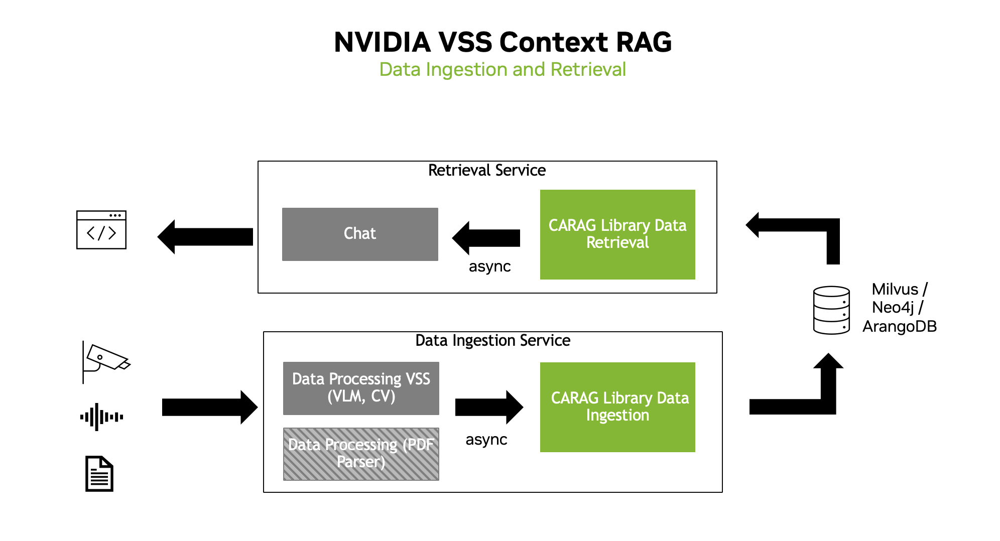

<!--
SPDX-FileCopyrightText: Copyright (c) 2025 NVIDIA CORPORATION & AFFILIATES. All rights reserved.
SPDX-License-Identifier: Apache-2.0
 *
Licensed under the Apache License, Version 2.0 (the "License");
you may not use this file except in compliance with the License.
You may obtain a copy of the License at
 *
http://www.apache.org/licenses/LICENSE-2.0
 *
Unless required by applicable law or agreed to in writing, software
distributed under the License is distributed on an "AS IS" BASIS,
WITHOUT WARRANTIES OR CONDITIONS OF ANY KIND, either express or implied.
See the License for the specific language governing permissions and
limitations under the License.
-->

# Architecture



-   Context Aware RAG allows the user to start both a Data Ingestion Service
    and a Data Retrieval Service
    -   The Data Ingestion Service is responsible for ingesting data
        into the database
        -   Database can be plug and play, Milvus, Neo4j, ArangoDB, etc.
    -   The Data Retrieval Service is responsible for retrieving data
        from the database
        -   Utilizes Graph-RAG, Vector-RAG or Foundation-RAG to retrieve relevant
            documents from the database to answer the user\'s query

## Components

```{mermaid}
:config: {"theme": "dark"}
:zoom:

  flowchart TD
      CM[Context Manager]

      %% Tools used by the Context Manager
      subgraph Tools [Tools]
        ST["StorageTool"]
        LT["LLMTool"]
        NT_TOOL["NotificationTool"]
      end

      %% StorageTool implementations with their embedding tools
      subgraph StorageImpl [StorageTool Implementations]
        subgraph MilvusImpl [Milvus]
          MILVUS["Milvus"]
          MILVUS_ET["EmbeddingTool"]
          MILVUS --> MILVUS_ET
        end

        subgraph Neo4jImpl [Neo4j]
          NEO4J["Neo4j"]
          NEO4J_ET["EmbeddingTool"]
          NEO4J --> NEO4J_ET
        end

        subgraph ArangoImpl [ArangoDB]
          ARANGO["ArangoDB"]
          ARANGO_ET["EmbeddingTool"]
          ARANGO --> ARANGO_ET
        end

        subgraph ElasticImpl [Elasticsearch]
          ELASTIC["Elasticsearch"]
          ELASTIC_ET["EmbeddingTool"]
          ELASTIC --> ELASTIC_ET
        end
      end

      %% Functions executed by the Context Manager
      subgraph Functions [Functions]
        IF["IngestionFunction"]
        RF["RetrievalFunction"]
        SF["SummarizationFunction"]
        NF["NotificationFunction"]
      end

      %% The Context Manager invokes Functions
      CM -- "Uses" --> IF
      CM -- "Uses" --> RF
      CM -- "Uses" --> SF
      CM -- "Uses" --> NF

      %% Functions use Tools
      IF --> |Uses| ST
      IF --> |Uses| LT

      RF --> |Uses| ST
      RF --> |Uses| LT

      SF --> |Uses| ST
      SF --> |Uses| LT

      NF --> |Uses| NT_TOOL
      NF --> |Uses| LT

      %% StorageTool implementations
      ST -.-> MILVUS
      ST -.-> NEO4J
      ST -.-> ARANGO
      ST -.-> ELASTIC

```

### Context Manager

The Context Manager is the central coordinator of the system. Its
responsibilities include:

-   **Asynchronous Processing**:
    -   Manages the flow between data ingestion, function execution, and
        final document retrieval.
    -   Calls different functions based on the analysis of user queries
        and the type of RAG (Graph-RAG vs. Vector-RAG) configured.
-   **Dynamic Function Execution**:
    -   Loads and configures various functions (e.g., ChatFunction,
        Summarization Functions) by leveraging the modular function and
        tool interfaces.
    -   Configurable with different RAG approaches (vector-based,
        graph-based, etc.)

### Tools and Functions

The system is built upon a clear separation between the logic
(functions) and external dependencies (tools):

-   **Tools**:
    -   Tools encapsulate the logic for interacting with external
        services such as databases (Neo4j for graph data, Milvus for
        vector embeddings).
    -   Examples include:
        - **StorageTool**:
            -   **VectorStorageTool**:
                -   **MilvusDBTool**:
                    -   Interfaces with the Milvus vector database to manage
                        document embeddings.
                    -   Provides efficient similarity searching by indexing and
                        retrieving document embeddings.
                -   **ElasticsearchDBTool**:
                    - Connects to local or remote Elasticsearch DB to manage vector document embeddings.
                    -   Provides efficient similarity searching by indexing and
                        retrieving document embeddings.
            -   **GraphStorageTool**:
                -   **Neo4jGraphDB**:
                    -   Provides integration with the Neo4j graph database to
                        store and query graph representations of documents.
                    -   Supports advanced retrieval strategies by converting
                        documents into graph structures and executing cypher
                        queries to retrieve relationships, entities, and
                        structured information from the graph.
                -   **ArangoDBTool**:
                    -   Connects to ArangoDB, a multi-model database that combines
                        document, key-value, and graph capabilities in a single
                        unified system.
                    -   Leverages ArangoDB's flexible schema design and native
                        multi-model approach to handle diverse data types and
                        complex document hierarchies with dynamic AQL queries
                        for comprehensive information extraction.
        - **LLMTool**:
            - **ChatOpenAITool**:
                - Wrapper over ChatOpenAI and ChatNVIDIA that enables communicating with LLM endpoints.
        - **NVIDIAEmbeddingTool**: Connects to NVIDIA embedding NIM for text vectorization used in GraphRAG and AdvancedGraphRAG.
        - **NVIDIARerankerTool**: Connects to NVIDIA reranking NIM.
        - **NotificationTool**:
            -   Serves as a lightweight interface for dispatching
                notifications and alerts within the system.
            -   Can be extended to integrate with various notification
                endpoints.
            - Subtypes:
            -   **EchoNotificationTool**: Console/terminal notification output
            -   **AlertSSETool**: Server-sent events notification system
-   **Functions**:
    -   The Function serves as the base interface for implementing
        processing routines in the Context Manager.
    -   Examples include:
        -   **Ingestion Functions**:
            -   **VectorIngestionFunc**: Processes documents into vector embeddings for vector databases
            -   **GraphIngestionFunc**: Extracts entities/relationships, builds knowledge graphs and community summaries
            -   **FoundationIngestionFunc**: NVIDIA RAG blueprint-based document ingestion

        -   **Retrieval Functions**:
            -   Handles retrieval and chat interactions
            -   Manages conversation context
            -   Integrates with LLMTool for response generation
            - Subtypes:
                -   **VectorRetrievalFunc**: Embedding-based similarity search and document ranking
                -   **GraphRetrievalFunc**: Graph traversal and entity-based retrieval using cypher queries
                -   **FoundationRetrievalFunc**: NVIDIA RAG blueprint integration with reranking
                -   **AdvGraphRAGFunc**: Chain-of-thought iterative graph reasoning for complex queries
                -   **VLMRetrievalFunc**: Vision-language model integration for image understanding
                -   **Planner**: Advanced graph traversal with tool-based reasoning (chunk_search, entity_search, chunk_reader)
                -   **SummaryRetriever**: Time-based summary extraction and aggregation

## Service Architecture

The Context-Aware RAG system consists of two main services:

1. **Data Ingestion Service** (default port: 8001) - Handles document ingestion and processing
2. **Retrieval Service** (default port: 8000) - Handles question answering and document retrieval

```{mermaid}
:config: {"theme": "dark"}
:zoom:

graph LR
    A[Client] --> B[Data Ingestion Service]
    A --> C[Retrieval Service]
    B --> D[Vector Store/Graph DB]
    C --> D
```

### Service Communication

- Both services must be initialized with the same UUID to ensure proper communication
- Services communicate through a shared database (vector store or graph DB)
- Each service has its own dedicated port for client communication
- Services can be scaled independently based on workload

### Service Responsibilities

1. **Data Ingestion Service**
   - Handles document ingestion and processing
   - Manages document chunking and embedding generation
   - Stores processed documents in the database
   - Provides health check endpoints

2. **Retrieval Service**
   - Handles user queries and question answering
   - Retrieves relevant documents from the database
   - Generates responses using LLM
   - Provides health check endpoints
